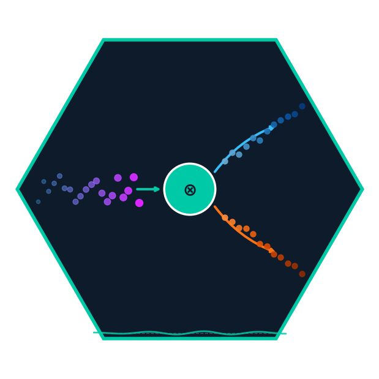

*Causal inference for the real world — one observation at a time.*

[](https://github.com/athammad/onlinecml/actions/workflows/ci.yml)
\
[](https://github.com/athammad/onlinecml)
[](https://athammad.github.io/onlinecml/)

## Why OnlineCML?

Every major causal inference library (EconML, CausalML, DoWhy) requires a
complete dataset before you begin. But many real-world applications don't
have that luxury:

- A/B tests where you want decisions *now*, not after 30 days
- Clinical trials where treatment effects must be monitored continuously
- Marketing systems where customer data arrives as a stream
- Any setting where the treatment effect might shift over time

OnlineCML processes one observation at a time. No batches. No waiting.

## Installation

```bash
pip install onlinecml
```

## Quickstart

```python
from onlinecml.datasets import LinearCausalStream
from onlinecml.reweighting import OnlineIPW

estimator = OnlineIPW()
for x, treatment, outcome, _ in LinearCausalStream(n=1000, true_ate=2.0, seed=42):
    estimator.learn_one(x, treatment, outcome)

print(f"ATE:   {estimator.predict_ate():.3f}")  # → ~2.0
print(f"95%CI: {estimator.predict_ci()}")
```

## Methods

| Method | Class | ATE | Individual CATE | Doubly Robust |
|---|---|:---:|:---:|:---:|
| Inverse Probability Weighting | `OnlineIPW` | ✓ | — | — |
| Augmented IPW | `OnlineAIPW` | ✓ | ✓ | ✓ |
| Overlap Weights | `OnlineOverlapWeights` | ✓ | — | — |
| S-Learner | `OnlineSLearner` | ✓ | ✓ | — |
| T-Learner | `OnlineTLearner` | ✓ | ✓ | — |
| X-Learner | `OnlineXLearner` | ✓ | ✓ | — |
| R-Learner | `OnlineRLearner` | ✓ | ✓ | — |
| Online Matching | `OnlineMatching` | ✓ | ✓ | — |
| Caliper Matching | `OnlineCaliperMatching` | ✓ | ✓ | — |
| Causal Hoeffding Tree | `CausalHoeffdingTree` | ✓ | ✓ | ✓ |
| Online Causal Forest | `OnlineCausalForest` | ✓ | ✓ | ✓ |

**Novel contributions:** `CausalHoeffdingTree` and `OnlineCausalForest` implement a
custom causal split criterion that maximises between-child CATE variance rather than
outcome MSE, with linear leaf models, doubly robust correction, multi-threshold split
search, and per-tree ADWIN drift detection.

**Policies:** `EpsilonGreedy`, `ThompsonSampling`, `UCB`

**Diagnostics:** `OnlineSMD`, `ATETracker` (with convergence plot and forgetting factor),
`OverlapChecker`, `ConceptDriftMonitor`

**Datasets:** `LinearCausalStream`, `HeterogeneousCausalStream`, `DriftingCausalStream`,
`UnbalancedCausalStream`, `ContinuousTreatmentStream`

**Evaluation:** `progressive_causal_score`, `PEHE`, `ATEError`, `UpliftAUC`, `QiniCoefficient`

## How it differs from batch libraries

| | DoWhy | EconML | CausalML | **OnlineCML** |
|---|:---:|:---:|:---:|:---:|
| Online / streaming | ✗ | ✗ | ✗ | **✓** |
| One-obs-at-a-time | ✗ | ✗ | ✗ | **✓** |
| Concept drift | ✗ | ✗ | ✗ | **✓** |
| Exploration policy | ✗ | ✗ | ✗ | **✓** |
| River compatible | ✗ | ✗ | ✗ | **✓** |
| Online causal forest | ✗ | ✗ | ✗ | **✓** |
| IPW / DR / Overlap | ✓ | ✓ | ✓ | **✓** |
| Meta-learners | ✓ | ✓ | ✓ | **✓** |
| CATE estimation | ✓ | ✓ | ✓ | **✓** |

## Documentation

Full documentation and example notebooks at [athammad.github.io/onlinecml](https://athammad.github.io/onlinecml/).

## Contributing

See [CONTRIBUTING.md](CONTRIBUTING.md). All PRs require unit tests and
must maintain >90% coverage.

## Citation

```bibtex
@software{onlinecml2025,
  title  = {OnlineCML: Online Causal Machine Learning in Python},
  author = {Hammad, Ahmed},
  year   = {2025},
  url    = {https://github.com/athammad/onlinecml}
}
```

## License

MIT
